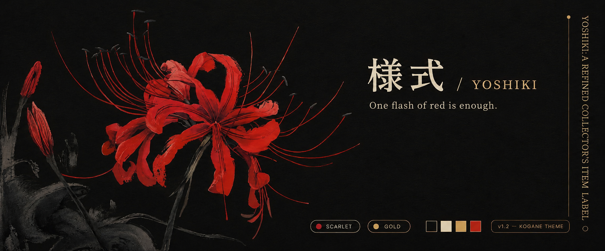

<p align="center">
  
</p>

<h1 align="center">様式&nbsp; yoshiki</h1>

<p align="center"><i>An elegant design language — warm monochrome, struck rarely by color.</i></p>

<p align="center">
  <a href="https://zinzaki.github.io/yoshiki/"><b>Live showcase ↗</b></a>
  &nbsp;·&nbsp; <a href="#palette">Palette</a>
  &nbsp;·&nbsp; <a href="#whats-inside">What's inside</a>
  &nbsp;·&nbsp; <a href="#quick-start">Quick start</a>
</p>

<br>

> Lacquer, bone and gold — struck rarely by two triggers: scarlet and moss.
> Color earns its power by being rare. Gold gilds; it never fills.

A complete, modular toolkit: a palette, text and UI patterns, ready terminal and
editor themes, and drop-in AI prompts. Take one file or the whole system —
everything generates from one source, in two themes: **kogane** (dark) and
**washi** (light).

## Palette

| Layer | Colors | Share |
|---|---|---|
| **Tone** | lacquer `#0B0A08` · bone `#EDE3C4` · gold `#D8AF52` · persimmon `#C67F45` | ~97% |
| **Triggers** | spider-lily scarlet `#d8392e` · moss `#52703F` | ~3% |
| **Service** | dusty-blue · wisteria · celadon — terminals & syntax only | — |

Three rules: **warm, never grey** · **color is rare** · **gold is a line, not a fill**.

## What's inside

```
yoshiki/
│
├─ canon/                  the definition — edited by hand, the source of truth
│  ├─ principles/          the ordered defaults — what wins when nothing is set
│  ├─ palette/             tokens · roles · contrast proof · kogane · washi
│  ├─ lexicon/             glyphs · nameplates · frames · CLI/TUI · code comments
│  ├─ motion/              loading & progress — dot-matrix
│  ╰─ prompts/             drop-in AI system prompts
│
├─ library/                the style in use — take & apply (much is generated)
│  ├─ themes/              kitty · foot · alacritty · starship · base24 · vscode · neovim · tmux · btop
│  ├─ configs/             whole example configs
│  ├─ snippets/            how to write code in the style, per language
│  ├─ menus/               ready TUI menus, cards, lists
│  ├─ charts/              text data-viz — sparkline · bars · gauge
│  ├─ text/                nameplates · banners · glyph sets · dividers
│  ╰─ presets/             named kits
│
├─ tools/build.py          bakes library/themes out of canon/palette
├─ PHILOSOPHY.md           why it looks like this
╰─ CHANGELOG.md            the sealed versions
```

## Quick start

```bash
# a terminal theme — copy one file
library/themes/kitty/kogane.conf        # or foot · alacritty · starship · base24

# web — CSS variables (raw tokens + semantic roles)
canon/palette/kogane/kogane.css

# make an AI follow the language — paste one prompt
canon/prompts/identity.md               # + principles.md for the defaults

# regenerate every theme from the palette
python3 tools/build.py
```

## Two layers

`canon/` **defines** the language; `library/` is the language **in use**. Two kinds
of color value: raw **tokens** (`ink-0`, `kin-1`) and the **roles** contract
(`text.body`, `action.edge`, `danger.fill`). Consume a role, never a raw token — a
role guarantees the right contrast in both themes.

## License

MIT — see [LICENSE](LICENSE).
