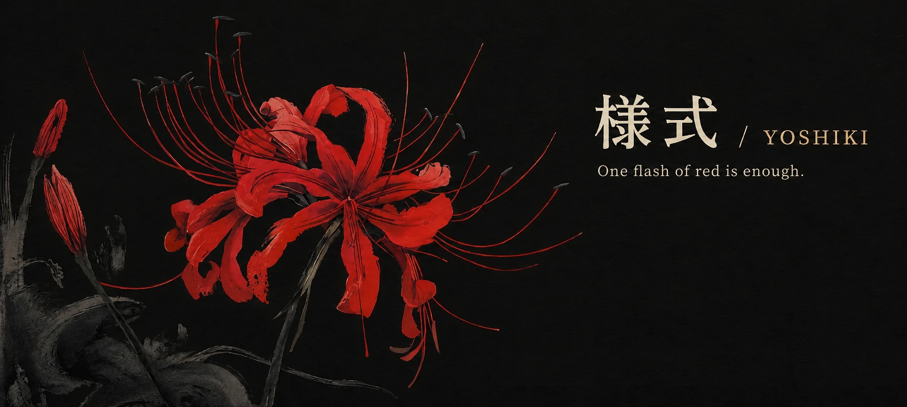

<p align="center">
  
</p>

<h1 align="center">様式&nbsp; yoshiki</h1>

<p align="center">A design language: warm monochrome, struck rarely by color.</p>

<p align="center">
  <a href="https://zinzaki.github.io/yoshiki/"><b>Live showcase ↗</b></a>
  &nbsp;·&nbsp; <a href="#palette">Palette</a>
  &nbsp;·&nbsp; <a href="#quick-start">Quick start</a>
  &nbsp;·&nbsp; <a href="#whats-inside">What's inside</a>
</p>

<br>

yoshiki is a visual system built around one idea: color is rare, so it means
something. Almost everything sits in a warm lacquer-and-bone monochrome; gold
appears only as a line or an edge; two accents (spider-lily scarlet and moss)
are reserved for events — danger and success.

The repo holds the definition and everything derived from it: a palette with a
semantic roles contract, terminal and editor themes, TUI patterns and a text
lexicon, CSS variables, W3C design tokens, and system prompts that teach the
style to an AI agent. Two themes share the same rules: **kogane** (dark) and
**washi** (light).


Gold gilds the prompt and the frame; success is a quiet moss check; the one
scarlet is spent on the single thing that blocks. Every mark above is the
language, generated from its palette source.

## Palette


| Layer | Colors | Share |
|---|---|---|
| Tone | lacquer `#0B0A08` · bone `#EDE3C4` · gold `#D8AF52` · persimmon `#C67F45` | ~97% |
| Triggers | scarlet `#d8392e` · moss `#52703F` | ~3% |
| Service | dusty-blue · wisteria · celadon — terminal ANSI and syntax only | — |

Three rules: warm, never grey · color is rare · gold is a line, not a fill.

Color values come in two kinds: raw **tokens** (`ink-0`, `kin-1`) and the
**roles** contract (`text.body`, `action.edge`, `danger.fill`). Consume a role,
never a raw token — a role guarantees readable contrast in both themes, and the
[contrast proof](canon/palette/CONTRAST.md) is regenerated and verified on
every build.

## Quick start

```bash
# a terminal theme — copy one file
library/themes/kitty/kogane.conf        # or ghostty · foot · alacritty · wezterm · …

# web — CSS variables (raw tokens + semantic roles)
canon/palette/kogane/kogane.css

# make an AI follow the language — point it at the repo (it reads AGENTS.md),
# or paste one prompt:
canon/prompts/identity.md               # + principles.md for the defaults

# regenerate everything from the palette source
python3 tools/build.py
```

## What's inside

```
yoshiki/
│
├─ AGENTS.md               how an agent applies yoshiki (read first)
├─ llms.txt                machine-readable index of every module
│
├─ canon/                  the definition — edited by hand, the source of truth
│  ├─ principles/          the ordered defaults — what wins when nothing is set
│  ├─ palette/             tokens · roles · contrast proof · kogane · washi
│  ├─ lexicon/             glyphs · nameplates · frames · CLI/TUI · code comments
│  ├─ motion/              loading & progress — spinners · dot-matrix · ▰▱
│  ├─ effects/             web effects — glass · grain · pointer · ambient
│  ├─ typography/          serif display + mono — Maple · JetBrains · Geist
│  ╰─ prompts/             drop-in AI system prompts
│
├─ library/                the style in use — take & apply
│  ├─ themes/              kitty · foot · alacritty · ghostty · wezterm · starship · base24 · vscode · neovim · tmux · btop · zellij · fzf
│  ├─ configs/             whole example configs
│  ├─ snippets/            how to write code in the style, per language
│  ├─ menus/               ready TUI menus, cards, lists
│  ├─ charts/              text data-viz — sparkline · bars · gauge
│  ├─ text/                nameplates · banners · glyph sets · dividers
│  ╰─ presets/             named kits
│
├─ tools/build.py          bakes library/themes out of canon/palette
├─ PHILOSOPHY.md           why it looks like this
╰─ CHANGELOG.md            the sealed versions
```

`canon/` defines the language; `library/` is the language in use. Everything
under `library/themes/` and the palette exports are generated — edit
`canon/palette/*/palette.yml` and rebuild.

## Build

[](https://github.com/zinzaki/yoshiki/actions/workflows/build.yml)

```bash
python3 tools/build.py          # regenerate themes, token exports, contrast proof
python3 tools/build.py --check  # verify committed output matches canon (runs in CI)
```

Requires Python 3 and PyYAML.

## License

MIT — see [LICENSE](LICENSE).
