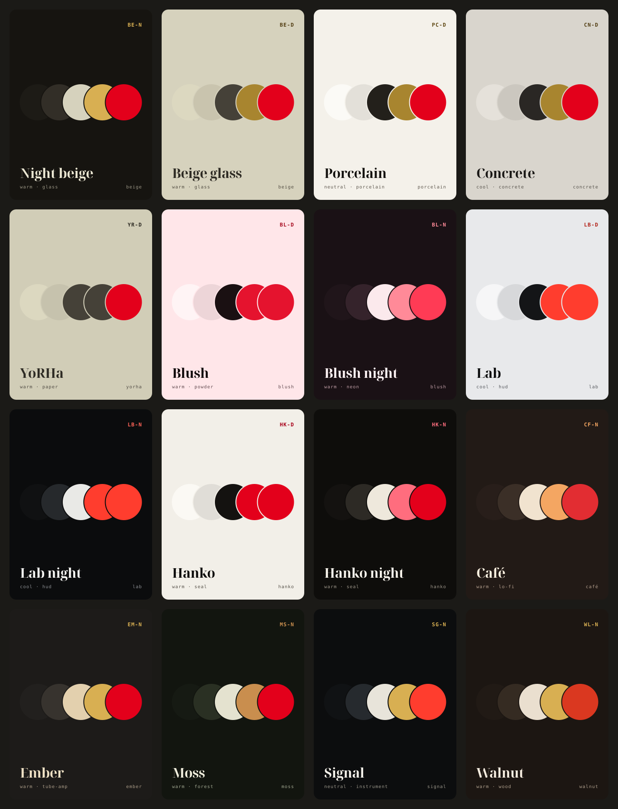

<p align="center">
  
</p>

<p align="center">
  <b>One contract. Many worlds.</b><br>
  A design library: sixteen proven palettes, a role contract that holds in every one of
  them, and a catalogue of components rebuilt from real references — sorted by the
  stylistic register they belong to, so a page never mixes two.
</p>

<p align="center">
  <a href="https://github.com/zinzaki/yoshiki/actions/workflows/build.yml"></a>
  
  
  
  
  <a href="LICENSE"></a>
</p>

<p align="center">
  <a href="https://zinzaki.github.io/yoshiki/"><b>Showcase</b></a> ·
  <a href="https://zinzaki.github.io/yoshiki/palettes.html">The palette room</a> ·
  <a href="https://zinzaki.github.io/yoshiki/gallery.html">Component gallery</a> ·
  <a href="AGENTS.md">For agents</a> ·
  <a href="PHILOSOPHY.md">Philosophy</a>
</p>

---

## What this is

Most design systems are one taste, written down. This one is a **library of registers**:
several complete stylistic worlds — a blueprint HUD, Swiss editorial, warm lo-fi, printed
halftone, soft relief, washi paper, an ornate game menu — each kept pure, each drawn with
the same three rules underneath.

| the rule | what it means |
|---|---|
| **Zone before style** | a terminal draws with characters, an app draws with real components. Nothing built for one is allowed in the other. |
| **Roles, never values** | a component asks for `text.primary` or `accent.edge`; the palette answers. Swap the palette and nothing breaks. |
| **One register per frame** | registers may live side by side in the library, never inside the same design. Mixing them is the fastest way to look generated. |

Colour is not the identity here. Sixteen palettes are equal citizens of the same
contract, and the warm gold one is simply the first among them, not the frame around
everything else.

---

## Sixteen palettes, twelve families

Every palette provides the same roles, carries a two-letter code, and is proved against
every surface it can land on before it ships.

| family | variants | material | | family | variants | material |
|---|---|---|---|---|---|---|
| **Beige** | `BE-N` night · `BE-D` day | glass | | **Hanko** | `HK-D` day · `HK-N` night | seal |
| **Blush** | `BL-D` day · `BL-N` night | powder · neon | | **Café** | `CF-N` night | lo-fi |
| **Lab** | `LB-D` day · `LB-N` night | HUD | | **Ember** | `EM-N` night | tube amp |
| **Porcelain** | `PC-D` day | porcelain | | **Moss** | `MS-N` night | forest |
| **Concrete** | `CN-D` day | concrete | | **Signal** | `SG-N` night | instrument |
| **YoRHa** | `YR-D` day | paper | | **Walnut** | `WL-N` night | wood |



Each one ships as a card, CSS variables, JSON, W3C DTCG tokens, a Slint theme, a Tailwind
preset entry and a Figma mode — all generated from one `palette.yml`.

---

## Roles are the contract

A raw token is a value and promises nothing. A **role** is a promise: ask for it and the
right value arrives in whichever palette is mounted, at a contrast that has been measured.

```css
.card {
  background: var(--r-bg-surface);
  color:      var(--r-text-primary);
  border:     1px solid var(--r-border-hairline);
}
.card[data-selected] { border-color: var(--r-accent-edge); }
```

```html
<html data-theme="hanko-night">   <!-- any of the sixteen slugs; omit for night-beige -->
```

The contract is written in [`canon/language/roles.md`](canon/language/roles.md): four
surfaces (`bg.app → surface → raised → hover`), a text hierarchy, borders, bars, a
**constant accent** the palette owns, and a **rare signal** kept for the irreversible.

### The proof

Roles are measured against **every surface they can sit on** — including hover, which is
often the worst ground in the set — and the build fails on a single cell below its floor.

| held to | floor |
|---|---|
| text roles — primary, heading, muted, link, ok, warn, signal | 4.5:1 |
| ghost text and gilding (an edge, not a word) | 3:1 |
| syntax roles on the editor ground, terminal ANSI on its own | 4.5:1 |

The current proof is [`canon/palettes/CONTRAST.md`](canon/palettes/CONTRAST.md),
regenerated on every build. A palette that needs a lower edge floor has to declare it,
with a reason, in its own `palette.yml`.

---

## The workshop: how a component gets in

Nothing enters because it looked nice in a screenshot.

```
265 references  →  782 catalogued parts  →  11 filters  →  246 rebuilt components
   private          every component of        F0…F10        palette-agnostic HTML,
   material         every image, named      in order        one register each
```

Extraction is exhaustive — every toggle, bar, menu, chart, texture and layout scheme in a
reference is written down ([`workshop/EXTRACTION.md`](workshop/EXTRACTION.md)), and the
sorting happens afterwards, in the open: substance, zone, register purity, distinctness,
palette proof, scale proof, accessibility, craft, taste, value to the whole
([`workshop/FILTERS.md`](workshop/FILTERS.md)). Rejections are recorded with their reason
so the same thing is not mined twice.

The result lives in [`library/previews/`](library/previews/) — 246 standalone HTML pieces
that consume roles only, in fourteen registers:

`blueprint-hud` 23 · `soft-product` 33 · `swiss-editorial` 26 · `brutalist-mono` 22 ·
`print-halftone` 20 · `glass-product` 19 · `moodboard-collage` 18 · `lo-fi-warm` 17 ·
`soft-relief` 16 · `generative-3d` 15 · `palette-card` 13 · `japanese-paper` 12 ·
`nier-menu` 8 · `other` 4

Browse them in [the gallery](https://zinzaki.github.io/yoshiki/gallery.html), where every
piece can be rendered in any of the sixteen palettes.

---

## Install

**Web** — two plain CSS files, no build step, all sixteen palettes:

```html
<link rel="stylesheet" href="library/web/palette.css">   <!-- tokens + roles -->
<link rel="stylesheet" href="library/web/yoshiki.css">   <!-- the component kit -->
<link rel="stylesheet" href="library/web/materials.css"> <!-- glass, glow, halftone, relief -->
```

**npm** — the same files, plus typed values and a Tailwind preset:

```bash
npm i yoshiki-design
```

```js
import 'yoshiki-design/css';
import 'yoshiki-design/kit.css';
import { nightBeige, hankoNight } from 'yoshiki-design';   // resolved values, typed

// tailwind.config.js
module.exports = { presets: [require('yoshiki-design/tailwind')] };
```

**Desktop (Slint)** — `library/integrations/yoshiki.slint` exports every palette as a
compile-checked struct, with per-family files beside it.

**Terminal or editor** — the generated program themes live in their own repository:
[`zinzaki/yoshiki-themes`](https://github.com/zinzaki/yoshiki-themes) (kitty · ghostty ·
foot · alacritty · wezterm · vscode · neovim · starship · tmux · zellij · btop · fzf ·
base24).

**An agent** — point it at the repository and it reads [`AGENTS.md`](AGENTS.md) first:
zone, then palette, then register. [`canon/registry.json`](canon/registry.json) is the
machine index of every material, object, pattern, effect and treatment;
[`registry.json`](registry.json) is the same set in shadcn's shape.

---

## What's in the box

<table>
<tr><th align="left" width="50%">canon — the definition</th><th align="left">library — the language in use</th></tr>
<tr><td valign="top">

- [`language/`](canon/language/) — zones, roles, defaults, what wins when nothing is said
- [`palettes/`](canon/palettes/) — sixteen palettes, their cards and the contrast proof
- [`materials/`](canon/materials/) — glass, glow, halftone, relief, seal, dither, topo
- [`objects/`](canon/objects/) — controls part by part, split by zone
- [`patterns/`](canon/patterns/) — layout schemes, not decoration
- [`physics/`](canon/physics/) — elevation, light, motion, metrics
- [`treatments/`](canon/treatments/) — clean and ornate, as a switch
- [`prompts/`](canon/prompts/) — drop-in modules for a model

</td><td valign="top">

- [`previews/`](library/previews/) — 246 rebuilt components, by register
- [`web/`](library/web/) — the kit: palette, components, materials, objects
- [`slint/`](library/slint/) · [`integrations/`](library/integrations/) — desktop, Tailwind, Figma, DTCG
- [`menus/`](library/menus/) · [`charts/`](library/charts/) · [`text/`](library/text/) — the text zone
- [`effects/`](library/effects/) · [`frames/`](library/frames/) · [`loaders/`](library/loaders/)
- [`github/`](library/github/) · [`image-prompts/`](library/image-prompts/)
- [`workshop/`](workshop/) — extraction, filters, research, the catalogue
- [`docs/`](docs/) — the generated showcase

</td></tr>
</table>

---

## Build

```bash
python3 tools/build.py            # palettes, exports, cards, banner, registry, proof
python3 tools/build.py --check    # CI: committed output matches canon, contrast holds
python3 tools/site_pages.py       # regenerate the three showcase pages from the library
python3 tools/check.py            # CI: no stray colour, no dead link, no drifted copy
python3 -m unittest discover -s tools/tests
```

Python 3 and PyYAML, nothing else. The showcase is **generated from the library**, so it
cannot drift from it: every palette on the site comes from `canon/palettes/`, every
component from `library/previews/`.

---

<p align="center">
  <sub>MIT — see <a href="LICENSE">LICENSE</a>. Built by <a href="https://github.com/zinzaki">Zinzaki</a>.</sub>
</p>
