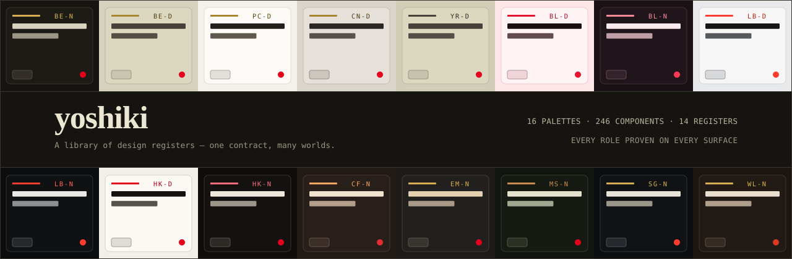
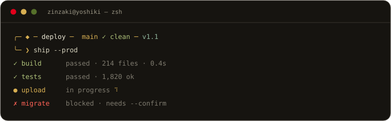
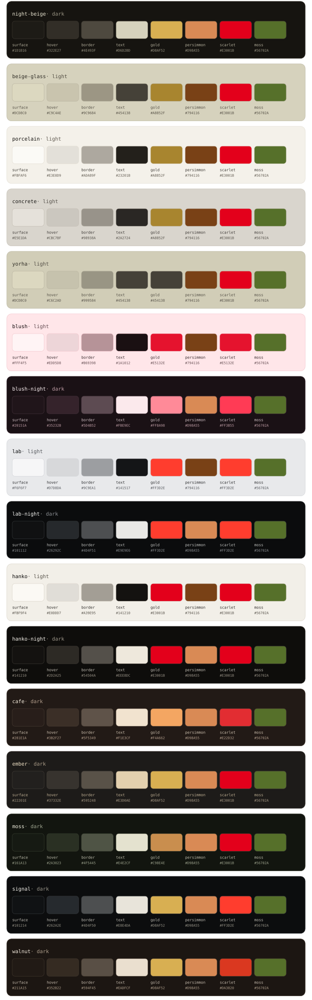

<p align="center">
  
</p>

<p align="center">
  <b>Warm monochrome, struck rarely by colour.</b><br>
  A design language with a palette you can prove, a component contract, thirteen
  generated themes, and prompt modules that teach it to a model.
</p>

<p align="center">
  <a href="https://github.com/zinzaki/yoshiki/actions/workflows/build.yml"></a>
  
  
  
  <a href="LICENSE"></a>
</p>

<p align="center">
  <a href="https://zinzaki.github.io/yoshiki/"><b>Live showcase</b></a> ·
  <a href="https://zinzaki.github.io/yoshiki/palette.html">Palette</a> ·
  <a href="https://zinzaki.github.io/yoshiki/components.html">Components</a> ·
  <a href="https://zinzaki.github.io/yoshiki/themes.html">Themes</a> ·
  <a href="PHILOSOPHY.md">Philosophy</a> ·
  <a href="AGENTS.md">For agents</a>
</p>

---

## The idea, in one minute

Colour is a signal, and a signal used everywhere is dead. So yoshiki spends
almost nothing: about 97% of any surface is a warm lacquer-and-bone monochrome,
gold appears only as a line or an edge, and two triggers — a spider-lily scarlet
and a moss green — are reserved for events. When something finally turns red, you
believe it.

Three rules hold the whole system up:

| | |
|---|---|
| **Warm, never grey** | every dark tone carries a brown lacquer undertone; text is bone, not white |
| **Gold gilds, never fills** | gold is a line, edge, frame or glyph — a primary button is a *gold-framed* surface with gold text, never a gold rectangle |
| **Rarity is the mechanism** | one accent per view, at most one scarlet per screen; unsure whether to add a colour — don't |

Two themes carry the same rules: **kogane** (dark lacquer) and **washi** (paper
and ink). Only the stage changes. The terminal never inverts — it stays a dark
island, even pinned to paper.



---

## Install

**Web** — two plain CSS files, no build step, both themes:

```html
<link rel="stylesheet" href="library/web/palette.css">  <!-- tokens + roles -->
<link rel="stylesheet" href="library/web/yoshiki.css">  <!-- the component kit -->
<html data-theme="washi">                               <!-- light; omit for dark -->
```

**npm** — the same files, plus typed values and a Tailwind preset:

```bash
npm i yoshiki-design
```

```js
import 'yoshiki-design/css';                     // tokens + roles
import 'yoshiki-design/kit.css';                 // the component kit
import { kogane, washi } from 'yoshiki-design';  // resolved values, typed

// tailwind.config.js
module.exports = { presets: [require('yoshiki-design/tailwind')] };
```

**Terminal or editor** — copy one file:

```bash
library/themes/kitty/kogane.conf     # or ghostty · foot · alacritty · wezterm
library/themes/vscode/kogane.json    # or neovim · starship · tmux · zellij · btop · fzf
```

**An AI agent** — point it at the repository and it reads [`AGENTS.md`](AGENTS.md)
first, or paste one prompt module from [`canon/prompts/`](canon/prompts/).

**Everything, regenerated** — `python3 tools/build.py` (Python 3 + PyYAML).

**Design tools** — one collection with two modes for Figma variables and Tokens
Studio (`library/integrations/figma-variables.json`), W3C DTCG tokens, and a
Style Dictionary config that builds CSS, JS, Swift and Android from them.

---

## Tokens are the paint. Roles are the contract.

A raw token is a value and promises nothing. A **role** is a promise: reach for
`text.body` or `action.edge` and the right value arrives in either theme, at a
contrast that has been measured against every surface it can land on.

```css
.thing {
  background: var(--r-bg-raised);
  color:      var(--r-text-body);
  border:     1.5px solid var(--r-action-edge);   /* gold gilds */
}
```

That split is what stops the classic mistake. Gold is readable as an *edge* but
not as a *word*, so the language separates `border.gold` from `text.gold` — and
on paper only the second one sinks. You cannot pick wrong if you reach for a role.



---

## The proof

Most palettes measure text against one flattering background. This one measures
every role against **every surface it can sit on** — including hover, which on
paper is the darkest ground of all — and **the build fails on a single cell below
its floor**.

| held to | floor |
|---|---|
| text roles — body, gold, link, ok, warn, danger, special | 4.5:1 |
| ghost text, and gilding (an edge, not a word) | 3:1 |
| syntax roles on the editor page, terminal ANSI on its ground | 4.5:1 |

That check found five real failures the day it was written. The current proof is
[`canon/palette/CONTRAST.md`](canon/palette/CONTRAST.md), regenerated on every
build; the rendered pages are swept separately by
[`tools/audit.mjs`](tools/audit.mjs), which composites the background actually
painted behind every text node rather than trusting the token it was meant to use.

---

## One source, thirteen targets

Nothing downstream is maintained by hand.

```
canon/palette/kogane/palette.yml          the source of truth
        │  washi inherits it and overrides only its deltas
        ▼
tools/build.py
        ├─ 13 program themes    kitty · foot · alacritty · ghostty · wezterm
        │                       starship · tmux · zellij · btop · fzf
        │                       vscode · neovim · base24
        ├─ token exports        CSS variables · JSON · W3C DTCG
        ├─ the web kit's palette, the site's colours, the banner and the mark
        └─ CONTRAST.md          the proof, enforced

tools/build.py --check     ← CI: committed output must match canon
tools/check.py             ← CI: no stray colour, no dead link, no drifted copy
```

A palette change reaches every program at once, and a fourteenth target costs one
`emit` block.

---

## What's in the box

```
yoshiki/
│
├─ AGENTS.md               how an agent applies the language (it reads this first)
├─ PHILOSOPHY.md           why it looks like this
├─ llms.txt                machine-readable index of every module
│
├─ canon/                  the definition — edited by hand, the source of truth
│  ├─ principles/          the ordered ladder: what wins when nothing is set
│  ├─ palette/             tokens · roles · contrast proof · kogane · washi
│  ├─ components/          the anatomy of a control, part by part
│  ├─ lexicon/             glyphs · frames · space · states · CLI · comments
│  ├─ motion/              loading & progress — spinners · dot-matrix · tapes
│  ├─ effects/             web effects — glass · grain · pointer · ambient
│  ├─ typography/          serif to speak, mono to count
│  ╰─ prompts/             drop-in modules that teach the language to a model
│
├─ library/                the language in use — take and apply
│  ├─ web/                 the drop-in kit: palette.css + yoshiki.css
│  ├─ themes/              kitty · foot · alacritty · ghostty · wezterm
│  │                       starship · tmux · zellij · btop · fzf
│  │                       vscode · neovim · base24
│  ├─ integrations/        Tailwind · Figma variables · Style Dictionary · typed tokens
│  ├─ frames/              twelve ways to draw an edge, and when each is wrong
│  ├─ menus/               22 ready TUI patterns — pickers, forms, panels, logs
│  ├─ loaders/             every way to say "working" — spinners, bars, stages
│  ├─ charts/              text data-viz — sparkline · bars · gauge
│  ├─ text/                nameplates · banners · dividers · glyph sets
│  ├─ snippets/            the style in code, per language
│  ├─ configs/             whole example configs
│  ├─ effects/             the web effects as working files
│  ├─ presets/             named kits, assembled
│  ├─ image-prompts/       recipes for generating images in the language
│  ╰─ github/              a README and profile wearing it
│
├─ tools/build.py          bakes every theme, export, asset and proof from canon
├─ tools/check.py          links, stray colour, drifted copies, stray characters
├─ tools/audit.mjs         sweeps the rendered pages for real contrast
╰─ docs/                   the showcase — github.io/yoshiki
```

`canon/` defines the language; `library/` is the language in use. Everything
under `library/themes/`, the palette exports, the banner, the mark and the
showcase's colours are generated — edit `canon/palette/*/palette.yml` and rebuild.

## Built for agents, not just people

An agent given only the repository link can apply the language without being
told how. [`AGENTS.md`](AGENTS.md) is the map it reads first: the read order, the
laws it may not break, and which module to load for the task at hand.
[`llms.txt`](llms.txt) is the machine index, and the palette also ships as
[W3C design tokens](canon/palette/kogane/kogane.tokens.json) for tooling that
wants structure instead of prose.

---

## Build

```bash
python3 tools/build.py          # regenerate every theme, export, asset and proof
python3 tools/build.py --check  # verify committed output matches canon (CI)
python3 tools/check.py          # links, stray colour, drifted copies (CI)
node tools/audit.mjs            # optional: sweep the rendered pages for real contrast
```

Requires Python 3 and PyYAML. Everything under `library/themes/`, the palette
exports, the banner, the mark and the showcase's colours are generated — edit
`canon/palette/*/palette.yml` and rebuild. `library/web/yoshiki.css` is the one
hand-written artifact, and the build mirrors it into `docs/` so the showcase
always wears the file it ships.

---

<p align="center">
  <sub>MIT — see <a href="LICENSE">LICENSE</a>. Built by <a href="https://github.com/zinzaki">Zinzaki</a>.</sub>
</p>
